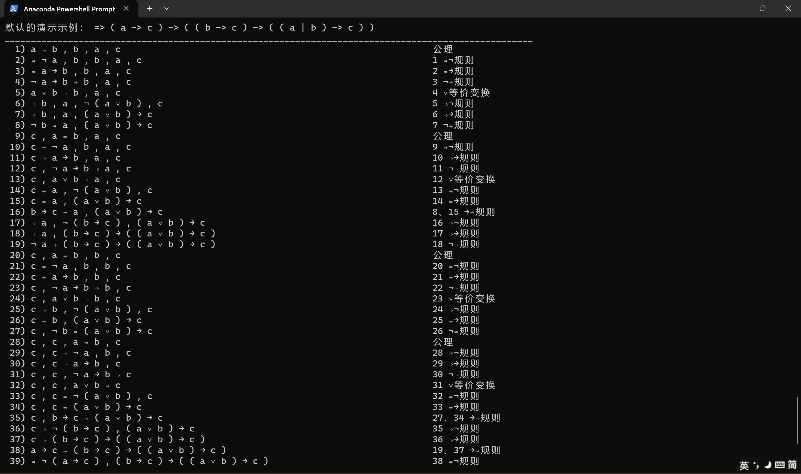

# <center>Wang's Algorithm in Python</center>

[English]: README_EN.md	"English"
[简体中文]: README.md	"简体中文"

使用了王浩算法完成了对公式的自动证明

两两检查输入的公式中的项，使用王浩算法中的10条推理规则逐步化简，直至推理出公理或不能推理出公理。程序将在控制台输出所有的推理步骤，不论输入的公式是否正确。

## 使用方法

在控制台中克隆并进入本仓库：

```bash
git clone git@github.com:QDKStorm/Wangs-Algorithm.git
cd Wangs-Algorithm
```

创建适合本项目的环境：

```bash
conda create -n wang python=3.11
conda activate wang
```

直接运行`test.py`即可：

```bash
python test.py
```

接下来可以在窗口中输入你需要推理的公式，公式需要以`=>`开头，公式中字母与符号间至少需要一个空格作为分隔（包括括号和字母之间）。如果在这个步骤中留空，则意味着将执行一个示例程序，示例程序中证明了`=> ( a -> c ) -> ( ( b -> c ) -> ( ( a | b ) -> c ) )`，并列出了证明的所有步骤。

输入的公式中，你可以使用`&`代替`∧`、用`|`代替`∨`、用`!`代替`¬`、用`->`代替`→`、用`<->`代替`↔`、用`=>`代替`⇒`，当然，如果选择直接输入这些符号，程序也可以运行，但不建议这么做。



我们推荐尝试如下示例来体验该程序：

- `=> a -> ( b -> a )`
- `=> ( a -> ( ( b -> a ) -> a ) ) -> ( ( a -> ( b -> a ) ) -> ( a -> a ) )`
- `=> p | q`（该公式是错误的，程序在提示公式错误之后仍然会给出推理过程，该推理过程将从一个不是公理的式子出发）
