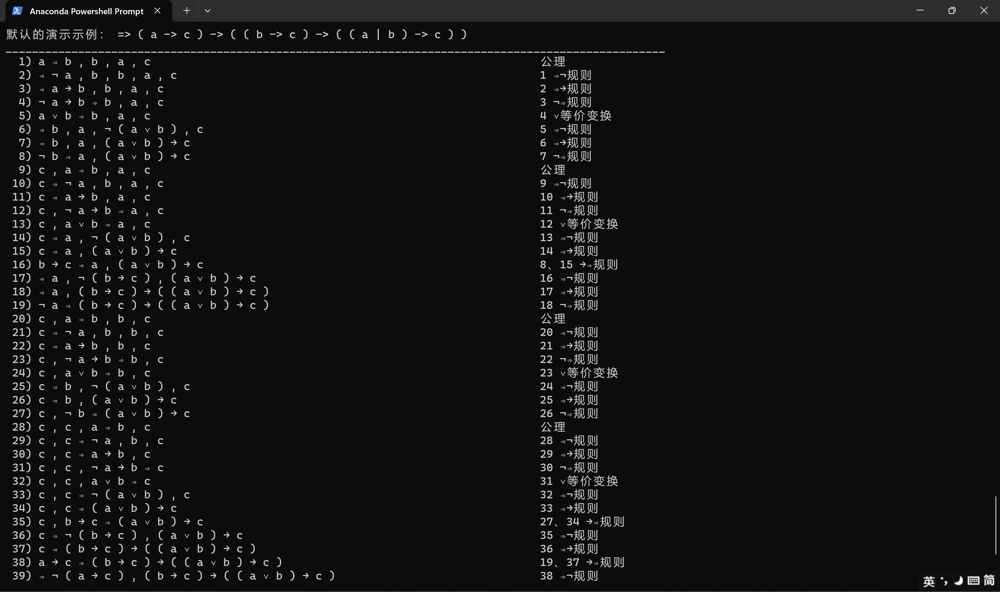

# <center>Wang's Algorithm in Python</center>

[English](README_EN.md) | [简体中文](README.md)

Automated proofs of formulas were accomplished using the Wang's algorithm

Check the terms in the input formula two by two and use the 10 inference rules in Wang's algorithm to simplify them step by step until the axioms are deduced or cannot be deduced. The program will output all the reasoning steps on the console, regardless of whether the input formula is correct or not.

## Usage

Clone and enter this repository in the console:

```bash
git clone git@github.com:QDKStorm/Wangs-Algorithm.git
cd Wangs-Algorithm
```

Create an environment suitable for this project:

```bash
conda create -n wang python=3.11
conda activate wang
```

Just run `test.py` directly:

```bash
python test.py
```

Next you can enter the formula you need to reason about in the window, the formula needs to start with `=>`, and the formula needs at least one space to separate the letters from the symbols (including between the parentheses and the letters). Leaving a space in this step means that a sample program will be executed, which proves `=> ( a -> c ) -> ( ( b -> c ) -> ( ( a | b ) -> c ) ` and lists all the steps of the proof.

In the input formulas, you can use `&` instead of `∧`, `|` instead of `∨`, `! ` instead of `¬`, `->` instead of `→`, `<->` instead of `↔`, and `=>` instead of `⇒`. Of course, the program can run if you choose to enter these symbols directly, but it is not recommended.



We recommend trying the following example to experience the program:

- `=> a -> ( b -> a )`
- `=> ( a -> ( ( b -> a ) -> a ) ) -> ( ( a -> ( b -> a ) ) -> ( a -> a ) )`
- `=> p | q` (the formula is wrong, and the program will still give a reasoning process after indicating that the formula is wrong, which will start from an equation that is not an axiom)
